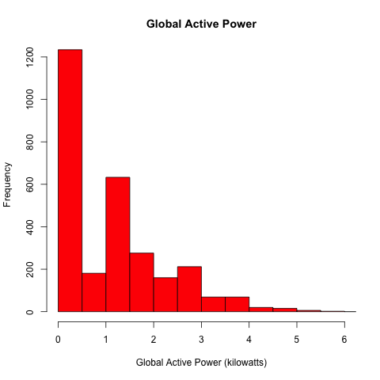
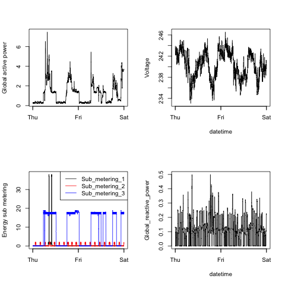

## Introduction

This Exploratory Data Analysis assignment uses data from
the <a href="http://archive.ics.uci.edu/ml/">UC Irvine Machine
Learning Repository</a>, a popular repository for machine learning
datasets. In particular, we used the "Individual household
electric power consumption Data Set".

## Data handling

* <b>Dataset</b>: <a href="https://d396qusza40orc.cloudfront.net/exdata%2Fdata%2Fhousehold_power_consumption.zip">Electric power consumption</a> [20Mb]

* <b>Description</b>: Measurements of electric power consumption in
one household with a one-minute sampling rate over a period of almost
4 years. Different electrical quantities and some sub-metering values
are available.


```
tbl <- read.table(file = file, dec = ".", stringsAsFactors = FALSE, colClasses = c("character", "character", "numeric", "numeric", "numeric", "numeric", "numeric", "numeric", "numeric"), header = TRUE, sep = ";", na.strings = "?")

# subset data to free space
data <- filter(tbl, Date %in% c("1/2/2007", "2/2/2007"))
rm(tbl)

# new column date_time for x axis
data$Date <- as.Date(data$Date, "%d/%m/%Y")
data <- mutate(data, date_time = as.POSIXct(paste(data$Date, data$Time, sep=" "), template = "%d/%m/%Y %H:%M:%S", tz = Sys.timezone()))

```

The following descriptions of the 9 variables in the dataset are taken
from
the <a href="https://archive.ics.uci.edu/ml/datasets/Individual+household+electric+power+consumption">UCI
web site</a>:

<ol>
<li><b>Date</b>: Date in format dd/mm/yyyy </li>
<li><b>Time</b>: time in format hh:mm:ss </li>
<li><b>Global_active_power</b>: household global minute-averaged active power (in kilowatt) </li>
<li><b>Global_reactive_power</b>: household global minute-averaged reactive power (in kilowatt) </li>
<li><b>Voltage</b>: minute-averaged voltage (in volt) </li>
<li><b>Global_intensity</b>: household global minute-averaged current intensity (in ampere) </li>
<li><b>Sub_metering_1</b>: energy sub-metering No. 1 (in watt-hour of active energy). It corresponds to the kitchen, containing mainly a dishwasher, an oven and a microwave (hot plates are not electric but gas powered). </li>
<li><b>Sub_metering_2</b>: energy sub-metering No. 2 (in watt-hour of active energy). It corresponds to the laundry room, containing a washing-machine, a tumble-drier, a refrigerator and a light. </li>
<li><b>Sub_metering_3</b>: energy sub-metering No. 3 (in watt-hour of active energy). It corresponds to an electric water-heater and an air-conditioner.</li>
</ol>

## Making Plots

The goal was to examine how household energy usage
varies over a 2-day period in February, 2007. The task was to
create the plots below, all of which were constructed
using the base plotting system.

The plots should look like the plots from this GitHub repository:
[https://github.com/rdpeng/ExData_Plotting1](https://github.com/rdpeng/ExData_Plotting1)


### Plot 1


 


### Plot 2

 


### Plot 3

 


### Plot 4

 

